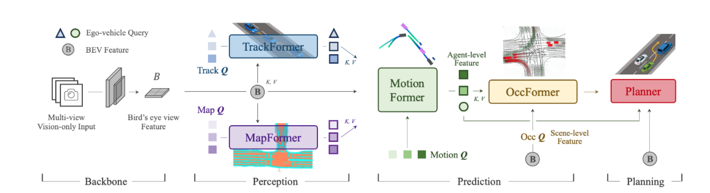

# Planning-oriented Autonomous Driving

CVPR2023最佳论文是上海人工智能实验室（上海 AI 实验室）、武汉大学及商汤科技联合提出的。
在2023 CVPR 最佳论文中，该论文提出的 UniAD 框架为业界首个感知决策一体化的自动驾驶通用大模型，开创了以全局任务为目标的自动驾驶架构先河，为自动驾驶大模型技术与产业的发展提出了新的指引方向。

UniAD 系统的设计和实施代表了自动驾驶技术的一个重大进步，首次将检测、跟踪、建图、轨迹预测、占据栅格预测以及规划整合到一个基于 Transformer 的端到端网络框架中。以下是对 UniAD 系统的整体性能和其在 nuScenes 数据集上实现的突破性成果的总结：

现代自动驾驶系统通常按模块任务顺序执行，即感知、预测和规划。为了执行多样化任务并实现高级智能，现有方法要么部署独立模型处理各个任务，要么设计具有独立头部的多任务范式。然而，这些方法可能因累积误差或任务协调不足而遭受不足。

**方法**：文中提出，理想的框架应该以规划为导向，优化以支持自动驾驶车辆的规划任务。基于此，重新审视了感知和预测中的关键组件，并优先处理这些任务，以促进规划任务。引入了名为 Unified Autonomous Driving（UniAD）的综合框架，该框架在一个网络中整合了完整的驾驶任务栈，巧妙地利用了每个模块的优势，并为从全局视角进行代理交互提供了补充的特征抽象。

**结果**：通过在具有挑战性的 nuScenes 基准测试上实例化 UniAD，通过广泛的消融实验，证明了使用这种理念的有效性，显著超越了先前的最先进技术。

### UniAD 统一自动驾驶系统的架构设计

#### 感知任务
UniAD 利用多摄像头输入，通过变压器解码器（Transformer Decoder）进行实时物体检测和跟踪。这一过程包括从多个视角合成鸟瞰视图（Bird’s-Eye View, BEV），为后续模块提供全局的空间信息。这样的设计使得系统能够在感知阶段就整合来自不同传感器的数据，从而提供更全面和精确的环境理解，为自动驾驶车辆的决策提供坚实的基础。

#### 预测任务
在预测模块中，UniAD 分析由感知模块检测到的对象及其环境数据，预测它们的未来状态和行动。这包括运动预测和占用格预测，通过先进的时空建模技术来预测每个代理的多模态未来轨迹。这个模块的关键在于能够准确预测各种环境因素的未来变化，这对于规划安全和有效的行车路线至关重要。

#### 规划任务
规划模块利用从感知和预测步骤得到的信息来制定行动策略，包括路径规划和避障。该模块考虑了预测的交通情况和环境占用信息，优化行车路线，确保行车安全。这一过程的核心是如何将感知到的信息和预测结果转化为具体的行动策略，以适应不断变化的道路条件。

### 技术实现

#### 变压器解码器
UniAD 在感知和预测模块中广泛使用变压器解码器结构，这种结构能够处理大规模的并行数据输入，并且通过自注意力机制有效地捕捉复杂的空间和时间依赖关系。这使得系统能够综合和分析来自多个源的大量数据，从而提高整体的处理效率和响应速度。

#### 查询机制
在 UniAD 中，各个任务模块通过统一的查询接口进行交互，查询机制允许系统在保持高效计算的同时，实现复杂的多任务协调和信息共享。这种设计使得信息在不同模块间流动更加高效，降低了错误传播的可能性，提高了决策的准确性。

#### 多模态数据处理
通过融合来自不同传感器的数据，UniAD 能够更全面地理解环境，提高感知的准确性和鲁棒性。这一点在处理复杂或低可见性场景时尤其重要，确保系统能在各种环境条件下都能维持高性能。

#### 端到端训练
UniAD 采用端到端的训练策略，整个网络从输入到输出可以共同优化，减少模块间的误差传递，提高整体性能。这种训练方式确保了不同模块能够更好地配合工作，优化整体的决策过程。

#### 误差处理和反馈
系统设计了反馈机制，能够根据实际行驶中遇到的误差动态调整预测和规划策略，使得自动驾驶系统更加适应不同的行驶环境和条件。这种自适应调整机制提高了系统在未知环境中的稳定性和安全性。

展示了 UniAD 系统的详细管道结构

### UniAD 结构

1. **输入和鸟瞰视图特征提取（Backbone）**:
   - **多视角视觉输入**：系统接收来自车辆周围多个摄像头的视觉输入。
   - **鸟瞰视图特征（BEV Feature）**：通过转换这些多视角输入，生成鸟瞰视图特征，为后续的感知和预测模块提供空间上的全局视图。

2. **感知模块**:
   - **TrackFormer**：利用鸟瞰视图特征进行实时跟踪，生成轨迹查询（Track Q）。
   - **MapFormer**：从鸟瞰视图中提取地图信息，生成地图查询（Map Q）。
   - 这两个模块共同工作，为预测模块提供必要的动态（如车辆和行人运动）和静态（如道路布局）信息。

3. **预测模块**:
   - **MotionFormer**：使用从TrackFormer和MapFormer得到的信息预测各代理的未来运动轨迹（Motion Q）。
   - **OccFormer**：预测未来时间点的占用格（Occupancy Grid），为规划模块提供可能的障碍物和占用区域信息。

4. **规划模块**:
   - **Planner**：结合感知和预测模块的输出，规划安全的驾驶路线和行为策略。这包括计算未来的导航点，以避开预测的障碍物和保持在正确的车道上。

### MotionFormer

**功能与作用**:
- **MotionFormer** 是一个基于变压器的模块，专门用于预测各个代理（如其他车辆、行人）的未来运动轨迹。它处理从感知模块如 **TrackFormer** 和 **MapFormer** 收集的数据，并预测这些代理在未来一段时间内的位置和运动状态。

**技术实现**:
- 使用自注意力机制分析动态代理的运动趋势。
- 输入包括代理的当前位置、速度以及其他相关动态特征，输出为预测的运动轨迹。

### OccFormer

**功能与作用**:
- **OccFormer** 用于生成未来特定时间点的占用网格（Occupancy Grid），预测静态和动态障碍物的位置。
- 这些占用网格为路径规划提供关键信息，帮助 **Planner** 确定安全路径，避开可能的障碍。

**技术实现**:
- 同样基于变压器架构，关注于处理和预测环境中的空间占用。
- 输入包括来自感知模块的环境布局数据和由 **MotionFormer** 提供的代理运动信息。

### Planner

**功能与作用**:
- **Planner** 是路径规划核心，负责综合感知和预测数据来生成实际的驾驶指令。
- 它使用来自 **MotionFormer** 的动态轨迹和 **OccFormer** 的占用网格信息，进行高级路径规划和行为决策，如避障、转向和速度控制。

**技术实现**:
- 基于模型和规则的决策系统，可能包括优化算法、图搜索技术和模拟驾驶场景的机器学习模型。
- 必须实时执行，以响应快速变化的驾驶环境。

### 协同工作机制

这三个组件在 UniAD 系统中密切协作，形成一个从感知到规划的闭环系统：
- **MotionFormer** 提供对所有动态代理未来位置的精确预测。
- **OccFormer** 利用这些预测和其他环境数据来估计未来的空间占用情况。
- **Planner** 利用上述信息进行决策，规划出一个既安全又高效的行驶路线。

这种集成的方法使得 UniAD 能够提高自动驾驶车辆的反应速度和决策质量，显著提升安全性和可靠性。通过这样的设计，UniAD 系统能够有效处理复杂的交通环境，提供优化的自动驾驶解决方案。

根据您提供的关于图2的详细描述，UniAD 系统利用多个基于变压器解码器的模块进行感知和预测任务，并结合一个规划模块来确保有效的自动驾驶。下面是每个组件如何贡献于系统整体功能的详细分解：

### 大概流程
1. **输入与特征提取**：
   - 多摄像头图像序列被处理以提取特征，这些特征随后通过一个称为 BEVFormer 的 BEV 编码器转换成统一的鸟瞰视图（BEV）特征。该编码器具有灵活性，允许使用各种替代方案通过长期时间融合或多模态融合等方法增强 BEV 表示的丰富性。

2. **TrackFormer**：
   - 利用轨迹查询来检测和追踪场景中的代理（例如其他车辆、行人）。这些查询是可学习的嵌入，从 BEV 特征中提取相关代理信息，使系统能够动态地识别和跟踪多个代理。

3. **MapFormer**：
   - 处理地图查询，这些查询作为道路元素（如车道和隔离带）的语义抽象。MapFormer 执行地图的全景分割，提供对驾驶环境至关重要的详细且分段的地图信息。

4. **MotionFormer**：
   - 捕捉代理和地图之间的交互，并预测每个代理的未来轨迹。该模块考虑每个代理行动对他人的潜在影响，进行必要的联合预测，这对于动态复杂的驾驶场景至关重要。

5. **OccFormer**：
   - 使用 BEV 特征作为查询，并装配代理级别的知识（键和值），预测多步未来的占用情况，同时保留代理身份。这一能力对于预测未来将被占用的区域至关重要，为避免碰撞的策略提供信息。

6. **Planner（规划器）**：
   - 整合前面模块的输出，特别是利用 MotionFormer 的表达性自车查询。规划器预测规划结果，通过避开 OccFormer 预测的占用区域来指导车辆安全导航。这种主动规划方法帮助维持与潜在危险的安全距离，并根据当前和预测的条件优化路线选择。

- **查询（Q）** 在这一架构中扮演至关重要的角色，作为不同模块之间的连接组织。它们使系统能够有效地模拟驾驶环境中不同实体间的复杂互动。
- 每个模块都设计为与其他模块无缝交互，使用查询将相关信息向前传递，确保每个后续模块具有执行其任务所需的上下文。

- **领域最佳性能**：在 nuScenes 真实场景数据集上，UniAD 在所有任务中均达到了领域最佳性能。这表明该系统的集成方法在处理复杂驾驶环境中的各种挑战方面具有显著优势。
- **多目标跟踪**：UniAD 的多目标跟踪准确率比当前最佳方案（State-of-the-Art, SOTA）高出 20%。这一显著提升证明了其跟踪算法的高效性和准确性。
- **车道线预测**：在车道线预测方面，准确率提高了 30%。这一改进对于增强车辆的路线规划和避障能力尤为重要。
- **预测和规划**：预测运动位移的误差降低了 38%，而规划的误差降低了 28%。这些进展表明，UniAD 能够更精确地预测和规划车辆行为，大幅提升了行车安全和效率。
- **端到端集成**：UniAD 是首个将自动驾驶的核心感知决策任务完全集成到一个端到端模型中的解决方案。这种一体化的方法简化了自动驾驶系统的设计，减少了模块间的错误传递和数据处理延时，提高了反应速度和系统稳定性。
- **应用与影响**：UniAD 的高性能和多任务处理能力使其具有广泛的市场应用潜力和重大的商业价值。系统的这些优势使得自动驾驶车辆能更有效地适应复杂环境，提供更安全、更可靠的驾驶体验。

- **安全与可靠性**：通过优化的预测和规划性能，UniAD 为自动驾驶车辆提供了更高的安全保障，降低了事故发生的风险，这对于提升公众对自动驾驶技术的信任和接受度至关重要。
